<p align="center">
  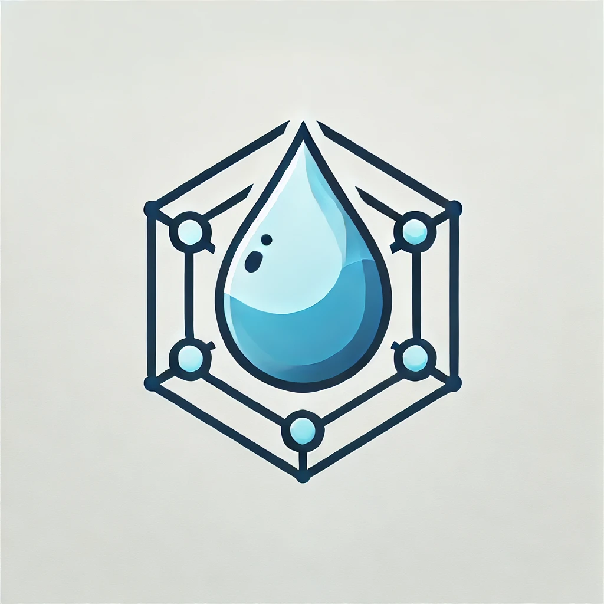
</p>

<h1 align="center">Water Framework</h1>
<p align="center"><i>"Empty your mind, be formless. Shapeless, like water. If you put water into a cup, it becomes the cup. You put water into a bottle and it becomes the bottle. You put it in a teapot, it becomes the teapot. Now, water can flow or it can crash. Be water, my friend."</i> — Bruce Lee</p>

<p align="center">
  <b>Write once. Run on Spring, OSGi, Quarkus — or all of them.</b>
</p>

---

## Table of Contents

1. [What is Water Framework?](#1-what-is-water-framework)
2. [Key Features](#2-key-features)
3. [The Three Pillars](#3-the-three-pillars)
4. [Architecture Overview](#4-architecture-overview)
5. [Getting Started](#5-getting-started)
6. [Core Concepts](#6-core-concepts)
   - [Components & Services](#61-components--services)
   - [Dependency Injection](#62-dependency-injection)
   - [Component Lifecycle](#63-component-lifecycle)
7. [Entity Management](#7-entity-management)
   - [Defining Entities](#71-defining-entities)
   - [Repository & CRUD](#72-repository--crud)
   - [QueryBuilder](#73-querybuilder)
   - [Pagination & Ordering](#74-pagination--ordering)
8. [REST API](#8-rest-api)
   - [Defining REST Endpoints](#81-defining-rest-endpoints)
   - [Entity CRUD Endpoints](#82-entity-crud-endpoints)
   - [JSON Views](#83-json-views)
   - [Exception Handling](#84-exception-handling)
9. [Security](#9-security)
   - [Authentication (JWT)](#91-authentication-jwt)
   - [Authorization (Roles & Permissions)](#92-authorization-roles--permissions)
   - [Security Annotations](#93-security-annotations)
10. [Multi-Runtime Support](#10-multi-runtime-support)
11. [Advanced Topics](#11-advanced-topics)
    - [Interceptors & AOP](#111-interceptors--aop)
    - [Event System](#112-event-system)
    - [Entity Extensions](#113-entity-extensions)
    - [Shared Entities](#114-shared-entities)
    - [Module Properties](#115-module-properties)
12. [Module Reference](#12-module-reference)
13. [Generator Commands](#13-generator-commands)
14. [Who Should Use It?](#14-who-should-use-it)
15. [License](#15-license)

---

## 1. What is Water Framework?

Water Framework is a **cross-framework** for Java that lets you write modular applications capable of running on different runtimes — **Spring**, **OSGi**, **Quarkus** — without changing a single line of business code.

Like water adapting to its container, the framework takes the shape of the runtime it runs on. A component annotated with `@FrameworkComponent` becomes a Spring Bean in Spring, a Declarative Service in OSGi, and a CDI bean in Quarkus — automatically.

Water Framework is not just a runtime abstraction. It ships with a complete set of **production-ready features out of the box**:

- User management with registration, activation, and password reset
- Granular role-based permission system
- JPA persistence with QueryBuilder API
- REST API layer with JWT authentication
- Event system for real-time applications
- Code generator for rapid scaffolding

All features follow a **"Convention over Coding"** paradigm: a set of code conventions, tools, and project structures that — when followed — drastically reduce development time, code maintenance, and architectural complexity.

---

## 2. Key Features

| Feature | Description |
|---------|-------------|
| **Cross-Runtime** | Single codebase runs on Spring, OSGi, Quarkus, or Standalone |
| **Code Generator** | Yeoman-based generator scaffolds full modules in seconds |
| **User Management** | Registration, activation, password reset, email confirmation |
| **Permission System** | Granular RBAC with entity-level, action-level, and custom permissions |
| **JPA Persistence** | Repository pattern with fluent QueryBuilder and pagination |
| **REST Layer** | Dual JAX-RS + Spring MVC support with Swagger/OpenAPI |
| **JWT Security** | Built-in JWT authentication with multi-issuer support |
| **Event System** | Publish/subscribe events across the application |
| **Interceptors** | AOP-like before/after method interception |
| **Entity Extensions** | Extend entities at runtime without modifying source |
| **Dependency Analysis** | Build-time circular dependency detection |
| **Stability Metrics** | Automated design quality measurement |

---

## 3. The Three Pillars

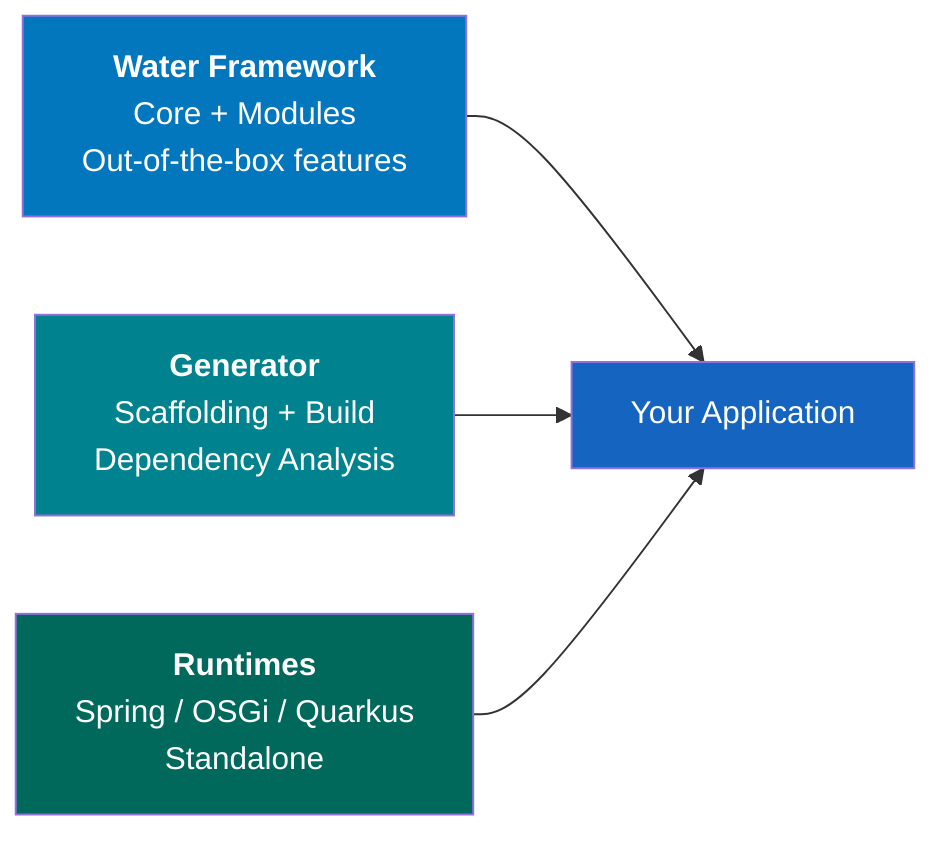

### Pillar 1: Water Framework

The framework provides a modular architecture with production-ready features. You can build applications that manage users, permissions, entities, and REST services in minutes. Choose between developing for a **specific runtime** (e.g., Spring only) or in **cross-framework mode** (runs everywhere).

### Pillar 2: Water Generator

A Yeoman-based code generator that:
- Scaffolds complete project structures (modules, entities, REST APIs)
- Supports both single-runtime and cross-framework modes
- Detects circular dependencies at build time
- Calculates **stability metrics** — ensuring modules with abstractions are highly imported, while implementation modules remain loosely coupled

### Pillar 3: Runtimes

Two development modes:

1. **Technology-specific** — Use Water as a productivity booster within your preferred framework. Components register as native Spring Beans, OSGi services, etc.
2. **Cross-framework** — Use `@FrameworkComponent` and Water annotations to write runtime-agnostic code that deploys anywhere.

---

## 4. Architecture Overview

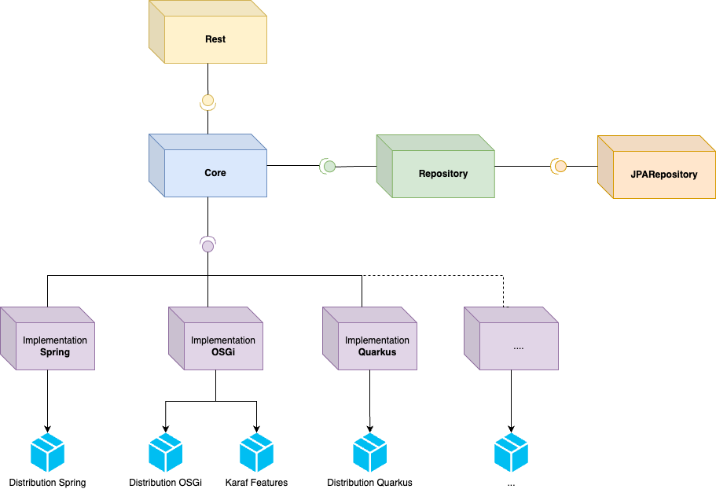

### Layer Diagram

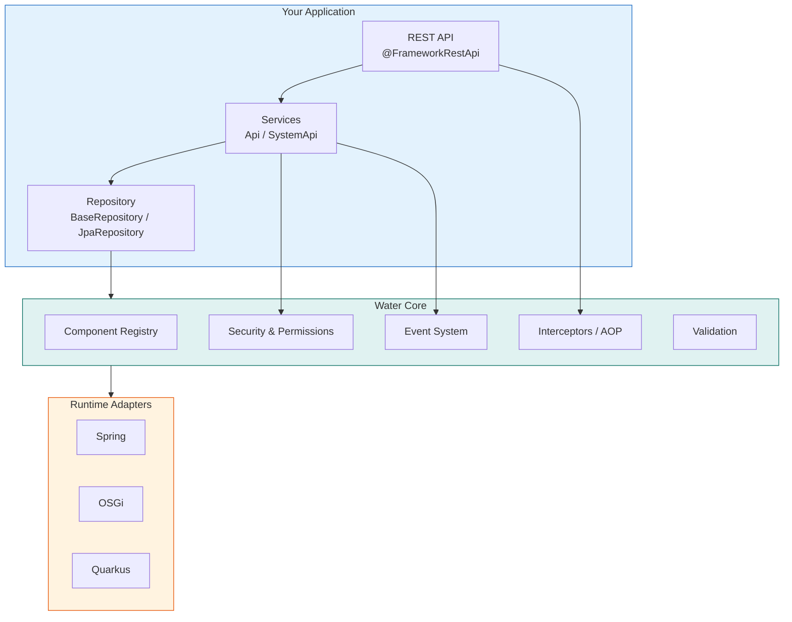

### Service Layer Architecture

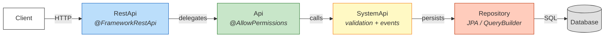

| Layer | Interface | Responsibility |
|-------|-----------|----------------|
| **REST** | `RestApi` | HTTP endpoints, JSON serialization, JWT validation |
| **API** | `BaseEntityApi` | Permission checks via security annotations |
| **System API** | `BaseEntitySystemApi` | Validation, events, business logic |
| **Repository** | `BaseRepository` | CRUD operations, queries, transactions |

---

## 5. Getting Started

### Prerequisites

| Tool | Minimum Version |
|------|----------------|
| Java (JDK) | 17 |
| Node.js | 18.20.8 |
| Gradle | 7.6+ |

> If you use **nvm**, run `nvm use 18.20.8` before using the generator.

### Install the Generator

```bash
npm install -g yo generator-water \
  --registry https://nexus.acsoftware.it/nexus/repository/npm-acs-public-repo
```

### Create Your First Project

```bash
# Create a new project (interactive — the generator will prompt for every option)
yo water:new-project

# Or inline (non-interactive — skip all prompts)
yo water:new-project --inlineArgs \
  --projectName=product-catalog \
  --projectTechnology=spring \
  --applicationType=entity \
  --modelName=Product \
  --hasRestServices=true \
  --restContextRoot=/products \
  --hasAuthentication=true
```

### Add an Entity to an Existing Project

```bash
# Add a new JPA entity with full CRUD stack to an existing project
yo water:add-entity
```

### Add REST Services to an Existing Project

```bash
# Add REST API layer to a project that doesn't have one
yo water:add-rest-services
```

### Build the Project

```bash
# Build selected projects (respects dependency order)
yo water:build --projects=product-catalog

# Build all projects in the workspace
yo water:build-all
```

### Run It

```bash
# Spring Boot
cd product-catalog/product-catalog-service
./gradlew bootRun
```

Your application starts with:
- REST endpoints for your entity (`/products`)
- JWT authentication
- User management (`/users`)
- Permission system
- Swagger documentation (`/v3/api-docs`)

---

## 6. Core Concepts

### 6.1 Components & Services

Every service in Water Framework implements the `Service` marker interface and is registered via `@FrameworkComponent`.

```java
// 1. Define the interface
public interface ProductService extends Service {
    Product findByCode(String code);
}

// 2. Implement it
@FrameworkComponent(services = ProductService.class)
public class ProductServiceImpl implements ProductService {
    @Override
    public Product findByCode(String code) {
        // business logic
    }
}
```

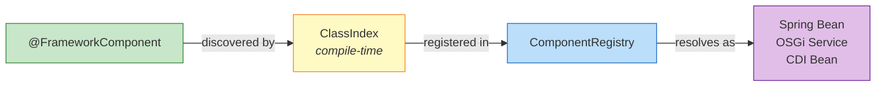

**Key points:**
- `services` parameter declares which interfaces this component registers under
- `priority` parameter (default: 1) controls resolution order — lower number = higher priority
- Components are discovered at **compile time** via Atteo ClassIndex (no classpath scanning)

### 6.2 Dependency Injection

Use `@Inject` to inject dependencies from the ComponentRegistry:

```java
@FrameworkComponent(services = OrderService.class)
public class OrderServiceImpl implements OrderService {

    @Inject @Setter
    private ProductService productService;   // Resolved from registry

    @Inject @Setter
    private ComponentRegistry componentRegistry;   // Registry itself

    @Override
    public Order createOrder(String productCode, int qty) {
        Product product = productService.findByCode(productCode);
        return new Order(product, qty);
    }
}
```

**Rules:**
- Annotate fields with `@Inject` and provide a **setter** (`@Setter` from Lombok works)
- By default, injection happens **dynamically** (`injectOnceAtStartup = false`)
- Set `@Inject(injectOnceAtStartup = true)` to inject once at startup for global singleton components

### 6.3 Component Lifecycle

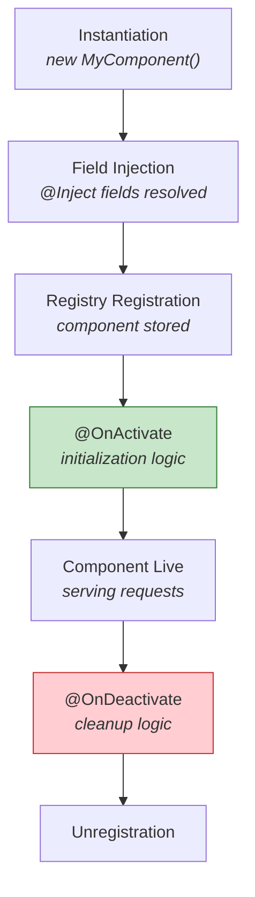

```java
@FrameworkComponent(services = CacheService.class)
public class CacheServiceImpl implements CacheService {

    @Inject @Setter
    private ApplicationProperties properties;

    private Map<String, Object> cache;

    @OnActivate
    public void onActivate() {
        int maxSize = (int) properties.getProperty("cache.maxSize");
        this.cache = new LinkedHashMap<>(maxSize);
        log.info("Cache initialized with maxSize={}", maxSize);
    }

    @OnDeactivate
    public void onDeactivate() {
        this.cache.clear();
        log.info("Cache cleared");
    }
}
```

`@OnActivate` methods can also receive parameters resolved from the registry:

```java
@OnActivate
public void onActivate(ComponentRegistry registry, ApplicationProperties props) {
    // Both parameters resolved automatically from the ComponentRegistry
}
```

---

## 7. Entity Management

### 7.1 Defining Entities

Entities extend `AbstractJpaEntity` which provides automatic ID generation, optimistic locking, and timestamps:

```java
@Entity
@Table(name = "product")
@Access(AccessType.FIELD)
public class Product extends AbstractJpaEntity {

    @Column(nullable = false, unique = true)
    @NotBlank
    private String code;

    @Column(nullable = false)
    @NotBlank
    private String name;

    @Column
    private String description;

    @Column(nullable = false)
    @Min(0)
    private BigDecimal price;

    // getters and setters
}
```

**Inherited fields from AbstractJpaEntity:**

| Field | Column | Type | Description |
|-------|--------|------|-------------|
| `id` | `id` | `long` | Auto-generated primary key |
| `entityVersion` | `entity_version` | `Integer` | Optimistic locking version |
| `entityCreateDate` | `entity_create_date` | `Date` | Auto-set on insert |
| `entityModifyDate` | `entity_modify_date` | `Date` | Auto-set on insert and update |

### 7.2 Repository & CRUD

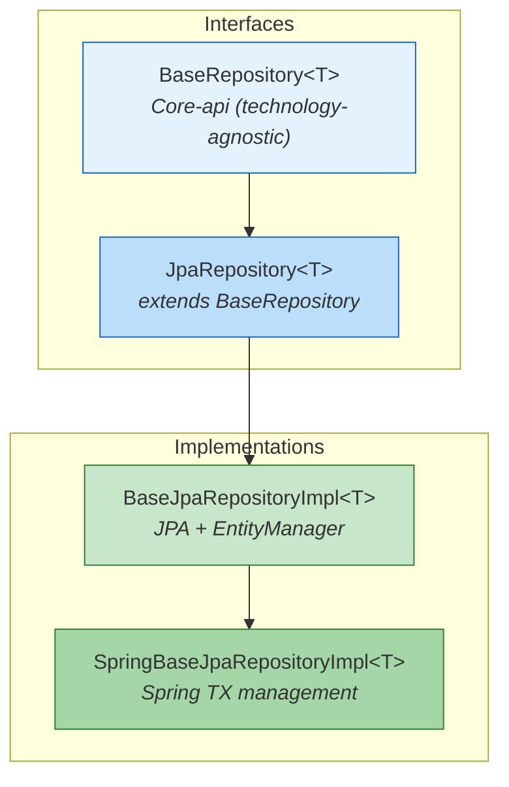

Define a repository for your entity:

```java
@FrameworkComponent(services = ProductRepository.class)
public class ProductRepositoryImpl extends BaseJpaRepositoryImpl<Product>
    implements ProductRepository {

    public ProductRepositoryImpl() {
        super(Product.class);
    }
}
```

All CRUD operations are inherited:

```java
// Create
Product saved = repository.persist(product);

// Read
Product found = repository.find(42L);

// Update
Product updated = repository.update(product);

// Delete
repository.remove(42L);

// Count
long total = repository.countAll(null);
```

### 7.3 QueryBuilder

The fluent QueryBuilder API constructs type-safe, technology-agnostic queries:

```java
QueryBuilder qb = repository.getQueryBuilderInstance();

// Simple equality
Query q = qb.field("code").equalTo("PRD-001");
Product product = repository.find(q);

// Range + AND
Query q = qb.field("price").greaterThan(10.0)
    .and(qb.field("price").lowerOrEqualThan(100.0));

// LIKE + OR
Query q = qb.field("name").like("%phone%")
    .or(qb.field("description").like("%phone%"));

// IN clause
Query q = qb.field("id").equalTo(1).in(List.of(1L, 2L, 3L));

// Nested fields (JPA relationships)
Query q = qb.field("category.name").equalTo("Electronics");

// NOT
Query q = qb.field("archived").equalTo(true).not();

// String-based (for REST query parameters)
Query q = qb.createQueryFilter("price > 10 AND name LIKE '%phone%'");
```

**Available operators:**

| Method | SQL Equivalent |
|--------|---------------|
| `equalTo(value)` | `= value` |
| `notEqualTo(value)` | `<> value` |
| `greaterThan(value)` | `> value` |
| `greaterOrEqualThan(value)` | `>= value` |
| `lowerThan(value)` | `< value` |
| `lowerOrEqualThan(value)` | `<= value` |
| `like(value)` | `LIKE value` |
| `.and(query)` | `AND` |
| `.or(query)` | `OR` |
| `.not()` | `NOT` |
| `.in(list)` | `IN (...)` |

### 7.4 Pagination & Ordering

```java
// Page 1, 20 items per page, filtered, ordered by name ASC
QueryOrder order = new DefaultQueryOrder();
order.addOrderField("name", true);   // true = ascending

Query filter = qb.field("price").greaterThan(0);

PaginableResult<Product> page = repository.findAll(
    20,      // delta (items per page, -1 for all)
    1,       // page (1-based)
    filter,  // query filter (null for no filter)
    order    // ordering (null for no order)
);

// Result metadata
page.getResults();      // List<Product> for this page
page.getCurrentPage();  // 1
page.getNumPages();     // total pages
page.getNextPage();     // 2 (or 1 if last page)
page.getDelta();        // 20
```

---

## 8. REST API

### 8.1 Defining REST Endpoints

Water uses a **dual-interface pattern** to support both JAX-RS and Spring MVC from a single definition:

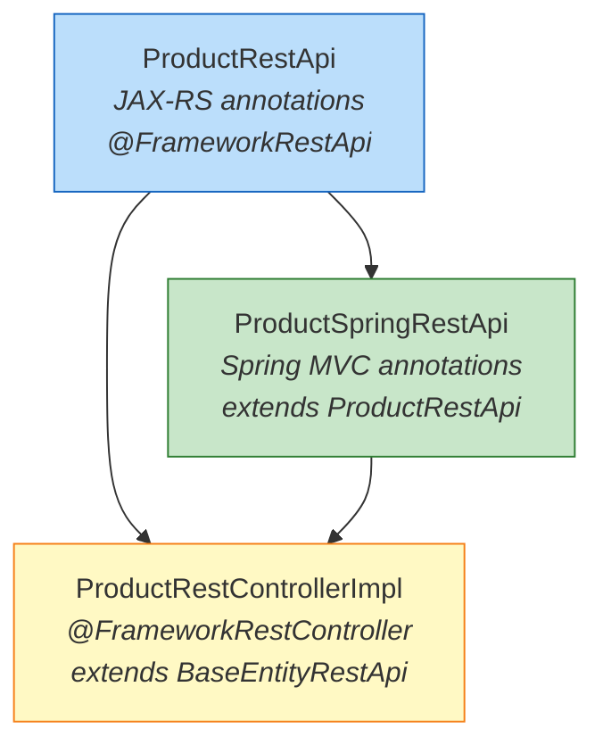

**Step 1 — Generic interface (JAX-RS):**

```java
@FrameworkRestApi
@Api(tags = "Product")
@Path("/products")
@LoggedIn
public interface ProductRestApi extends RestApi {

    @POST
    @Consumes(MediaType.APPLICATION_JSON)
    @Produces(MediaType.APPLICATION_JSON)
    Product saveProduct(@JsonView(WaterJsonView.Public.class) Product entity);

    @PUT
    @Consumes(MediaType.APPLICATION_JSON)
    @Produces(MediaType.APPLICATION_JSON)
    Product updateProduct(@JsonView(WaterJsonView.Public.class) Product entity);

    @GET @Path("/{id}")
    @Produces(MediaType.APPLICATION_JSON)
    @JsonView(WaterJsonView.Public.class)
    Product findProduct(@PathParam("id") long id);

    @DELETE @Path("/{id}")
    void removeProduct(@PathParam("id") long id);

    @GET
    @Produces(MediaType.APPLICATION_JSON)
    @JsonView(WaterJsonView.Public.class)
    PaginableResult<Product> findAllProducts(
        @QueryParam("delta") int delta,
        @QueryParam("page") int page);
}
```

**Step 2 — Spring interface (adds Spring annotations):**

```java
@FrameworkRestApi
@RequestMapping("/products")
public interface ProductSpringRestApi extends ProductRestApi {

    @PostMapping(consumes = "application/json", produces = "application/json")
    Product saveProduct(@RequestBody Product entity);

    @PutMapping(consumes = "application/json", produces = "application/json")
    Product updateProduct(@RequestBody Product entity);

    @GetMapping(value = "/{id}", produces = "application/json")
    Product findProduct(@PathVariable("id") long id);

    @DeleteMapping("/{id}")
    void removeProduct(@PathVariable("id") long id);

    @GetMapping(produces = "application/json")
    PaginableResult<Product> findAllProducts(
        @RequestParam("delta") int delta,
        @RequestParam("page") int page);
}
```

**Step 3 — Controller implementation:**

```java
@FrameworkRestController(referredRestApi = ProductRestApi.class)
public class ProductRestControllerImpl extends BaseEntityRestApi<Product>
    implements ProductRestApi, ProductSpringRestApi {

    @Inject @Setter
    private ProductApi productApi;

    @Override
    protected BaseEntityApi<Product> getEntityService() {
        return productApi;
    }
    // All CRUD methods inherited from BaseEntityRestApi
}
```

### 8.2 Entity CRUD Endpoints

`BaseEntityRestApi<T>` provides default implementations for:

| HTTP Method | Path | Operation |
|------------|------|-----------|
| `POST` | `/products` | Create entity |
| `PUT` | `/products` | Update entity |
| `GET` | `/products/{id}` | Find by ID |
| `DELETE` | `/products/{id}` | Remove by ID |
| `GET` | `/products?delta=20&page=1&filter=...&order=...` | Paginated list |

### 8.3 JSON Views

Control which fields are serialized per endpoint using `WaterJsonView`:

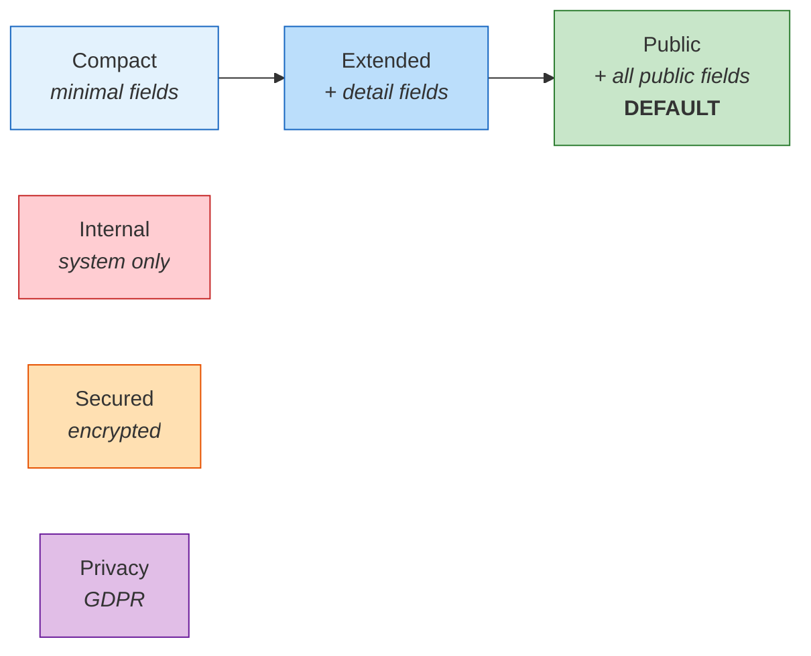

```java
@Entity
public class Product extends AbstractJpaEntity {
    @JsonView(WaterJsonView.Compact.class)
    private String name;           // in Compact, Extended, Public

    @JsonView(WaterJsonView.Extended.class)
    private String description;    // in Extended, Public only

    @JsonView(WaterJsonView.Internal.class)
    private String internalCode;   // never exposed via REST
}
```

### 8.4 Exception Handling

Exceptions are automatically mapped to HTTP responses:

| Exception | HTTP Status |
|-----------|------------|
| `UnauthorizedException` | 401 Unauthorized |
| `EntityNotFound` | 404 Not Found |
| `NoResultException` | 404 Not Found |
| `DuplicateEntityException` | 409 Conflict |
| `ValidationException` | 422 Unprocessable Entity |
| `RuntimeException` | 500 Internal Server Error |

No try/catch needed in controllers — the `GenericExceptionMapperProvider` handles everything.

---

## 9. Security

### 9.1 Authentication (JWT)

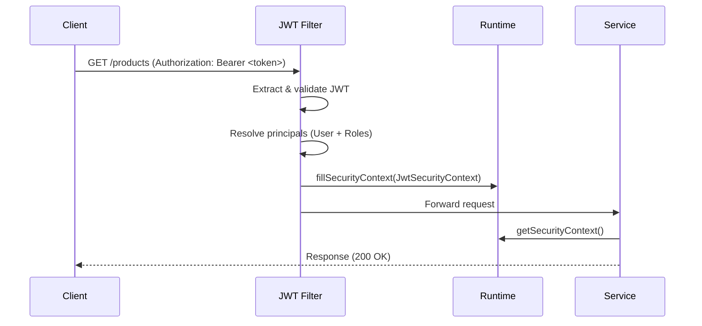

Endpoints annotated with `@LoggedIn` require a valid JWT token:

```java
@LoggedIn  // All methods require authentication
@Path("/products")
public interface ProductRestApi extends RestApi {

    @GET @Path("/public/catalog")
    // No @LoggedIn here — this method is public
    List<Product> getPublicCatalog();

    @POST
    @LoggedIn(issuers = {"com.example.model.User"})  // Custom issuer
    Product createProduct(Product product);
}
```

**Token format:** Standard JWT with user principal and role principals, transmitted via `Authorization: Bearer <token>` header or `HIT-AUTH` cookie.

### 9.2 Authorization (Roles & Permissions)

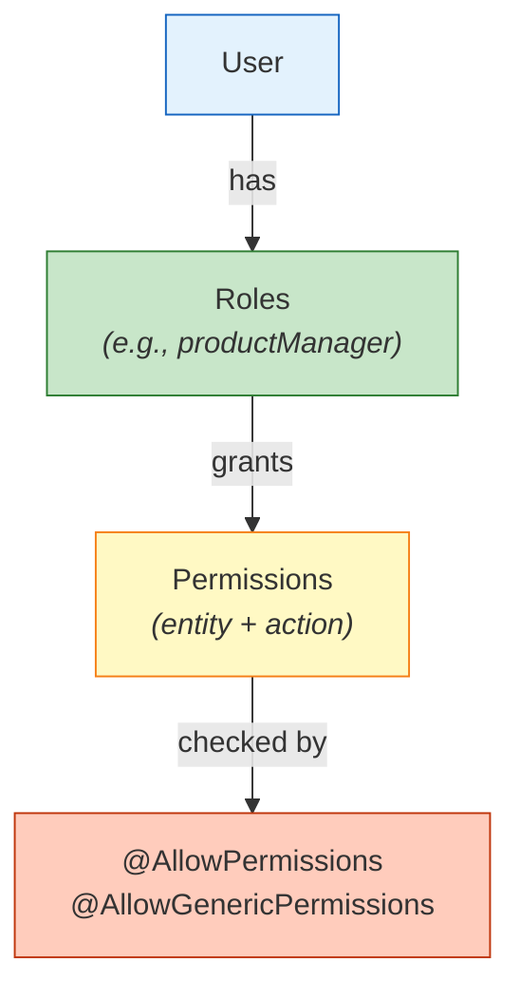

Water implements a **three-level** permission model:

1. **Actions** — What can be done (SAVE, UPDATE, FIND, REMOVE, FIND_ALL, ...)
2. **Resources** — Which entities the action applies to
3. **Roles** — Groups of permissions assigned to users

Default roles are generated per entity:
- `<entity>Manager` — full CRUD
- `<entity>Viewer` — read only
- `<entity>Editor` — create and update

### 9.3 Security Annotations

```java
// Permission on a specific entity instance (checked by ID)
@AllowPermissions(
    actions = {CrudActions.SAVE},
    checkById = true,
    idParamIndex = 0,
    systemApiRef = "com.example.api.ProductSystemApi"
)
Product save(Product entity);

// Permission on a resource type (not instance-specific)
// Attributes: actions, resourceName (explicit class name),
//             resourceParamName (extract resource name from method parameter)
@AllowGenericPermissions(
    actions = {CrudActions.FIND_ALL},
    resourceName = "com.example.model.Product"
)
PaginableResult<Product> findAll(int delta, int page);

// Permission checked on the return value
@AllowPermissionsOnReturn(actions = {CrudActions.FIND})
Product find(long id);
```

---

## 10. Multi-Runtime Support

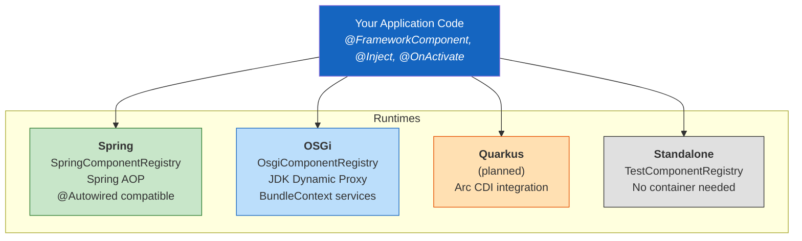

| Aspect | Spring | OSGi | Standalone/Test |
|--------|--------|------|-----------------|
| **Registry** | `SpringComponentRegistry` | `OsgiComponentRegistry` | `TestComponentRegistry` |
| **Backing store** | `BeanFactory` | `BundleContext` | `HashMap` |
| **Interceptors** | Spring AOP `@Aspect` | JDK Dynamic Proxy | `TestServiceProxy` |
| **Configuration** | `application.properties` | `it.water.application.cfg` | Manual `Properties` |
| **TX Management** | `TransactionTemplate` | Manual `EntityTransaction` | Manual |
| **Discovery** | ClassIndex + BeanFactory | ClassIndex + BundleContext | ClassIndex |

### Choosing a Development Mode

**Single-runtime** — You use Spring (or OSGi) directly and Water enhances it:

```java
@SpringBootApplication
@EnableWaterFramework   // Activates Water in Spring
public class MyApp {
    public static void main(String[] args) {
        SpringApplication.run(MyApp.class, args);
    }
}
```

**Cross-framework** — You use only Water annotations, and the code runs everywhere:

```java
@FrameworkComponent(services = MyService.class)
public class MyServiceImpl implements MyService {
    @Inject @Setter
    private AnotherService dependency;
    // Runs on Spring, OSGi, Quarkus — unchanged
}
```

---

## 11. Advanced Topics

### 11.1 Interceptors & AOP

Water provides method-level interception for cross-cutting concerns:

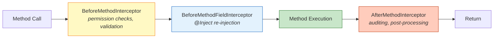

Every service method call passes through the interceptor chain. Built-in interceptors handle:
- **Permission enforcement** — `@AllowPermissions` annotations
- **Field injection** — `@Inject(injectOnceAtStartup = false)` fields
- **Custom logic** — implement `BeforeMethodInterceptor<A>` or `AfterMethodInterceptor<A>`

### 11.2 Event System

Entity lifecycle events are produced automatically:

| Event | When |
|-------|------|
| `PreSaveEvent` | Before persist |
| `PostSaveEvent` | After persist (entity has ID) |
| `PreUpdateEvent` | Before update |
| `PreUpdateDetailedEvent` | Before update (with before/after state) |
| `PostUpdateDetailedEvent` | After update (with before/after state) |
| `PreRemoveEvent` | Before delete |
| `PostRemoveEvent` | After delete |

Subscribe to events by registering an `ApplicationEventProducer` component.

### 11.3 Entity Extensions

Entities implementing `ExpandableEntity` can be extended at runtime without modifying source code:

```java
public class Product extends AbstractJpaExpandableEntity {
    // Original fields...
}

// A separate module adds fields via EntityExtensionService
// Extension data is stored in a separate table (one-to-one)
// Serialized/deserialized automatically with WaterJacksonModule
```

### 11.4 Shared Entities

The `SharedEntity` module enables sharing owned entities between users with configurable permissions.

### 11.5 Module Properties

Use the `Options` pattern for configurable module properties:

```java
public interface ProductOptions extends Service {
    int maxProductsPerCategory();
    String defaultCurrency();
}
```

Properties are resolved from `ApplicationProperties` with environment variable support and runtime overrides.

---

## 12. Module Reference

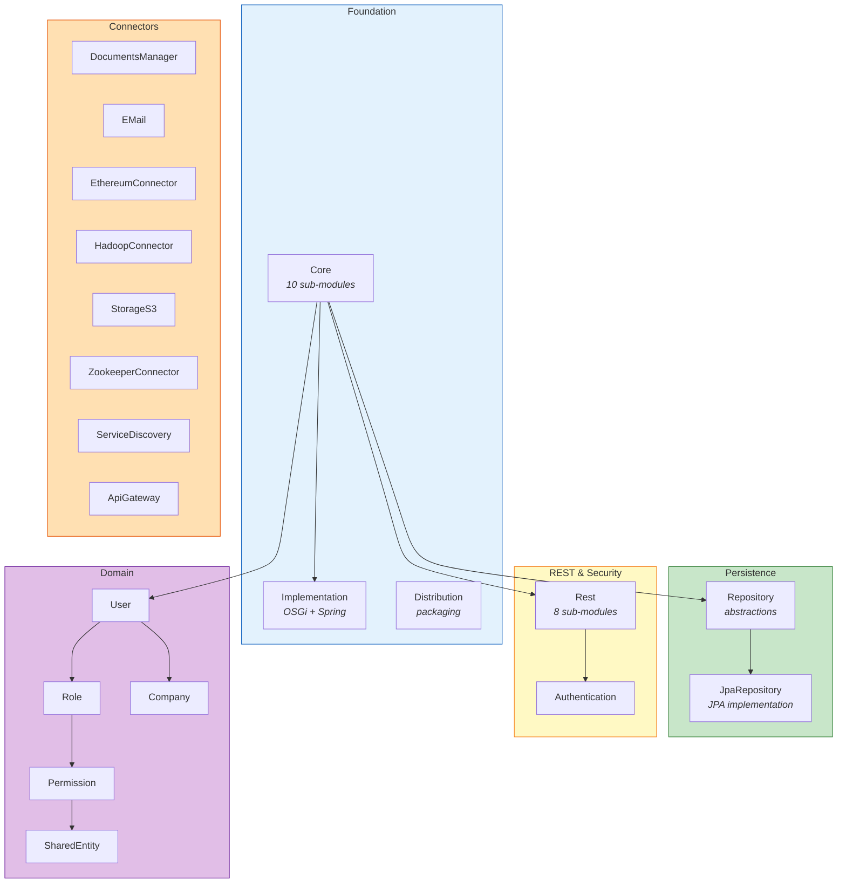

| Module | Description |
|--------|-------------|
| **Core** | Foundation: interfaces, registry, interceptors, security, validation, testing |
| **Implementation** | Runtime adapters for OSGi and Spring |
| **Distribution** | Packaging for OSGi (Karaf), Spring Boot, Quarkus |
| **Repository** | Technology-agnostic persistence abstractions |
| **JpaRepository** | JPA-based repository implementations |
| **Rest** | REST API layer: JAX-RS, Spring MVC, JWT, Swagger |
| **Authentication** | Login flows and authentication providers |
| **User** | User registration, activation, password management |
| **Role** | Role definitions and role-user associations |
| **Permission** | Granular RBAC permission management |
| **SharedEntity** | Entity sharing between users |
| **Company** | Company/organization entity management |
| **DocumentsManager** | Document upload and storage |
| **EMail** | Email service with template support |
| **EthereumConnector** | Ethereum blockchain integration |
| **HadoopConnector** | Hadoop integration |
| **ZookeeperConnector** | Zookeeper for clustering |
| **ServiceDiscovery** | Service discovery mechanisms |
| **ApiGateway** | API gateway and routing |

---

## 13. Generator Commands

### Scaffolding

| Command | Description |
|---------|-------------|
| `yo water:new-project` | Create a new microservice project with model, API, and service layers |
| `yo water:add-entity` | Add a new JPA entity (with full CRUD stack) to an existing project |
| `yo water:add-rest-services` | Add REST API layer to an existing project that doesn't have one |
| `yo water:new-empty-module` | Add a custom Gradle sub-module to an existing project |
| `yo water:new-entity-extension` | Extend an entity from another module (e.g., extend WaterUser) |

### Build & Publish

| Command | Description |
|---------|-------------|
| `yo water:build` | Build selected workspace projects (respects dependency order) |
| `yo water:build-all` | Build all projects in the workspace |
| `yo water:publish` | Publish selected projects to a Maven repository |
| `yo water:publish-all` | Publish all workspace projects |

### Utilities

| Command | Description |
|---------|-------------|
| `yo water:projects-order` | Define build/deploy precedence for projects |
| `yo water:projects-order-show` | Display current project build order |
| `yo water:stabilityMetrics` | Analyze code quality (abstraction, instability, zones) |
| `yo water:help` | Show available commands; add `--fulltext` for full docs |

> **Note:** `yo water:app` is the default Yeoman entry point and does nothing. Always use a specific sub-generator (e.g., `yo water:new-project`).

### `new-project` flags

| Flag | Description |
|------|-------------|
| `--inlineArgs` | Skip interactive prompts, pass all parameters inline |
| `--projectName` | Project name in kebab-case (e.g., `product-catalog`) |
| `--projectTechnology` | Runtime: `water` (default), `spring`, `osgi`, `quarkus` |
| `--applicationType` | `entity` (with persistence) or `service` (integration only) |
| `--modelName` | Entity class name in PascalCase (e.g., `Product`) |
| `--hasRestServices` | Generate REST controllers and Karate tests (`true`/`false`) |
| `--restContextRoot` | REST base path (e.g., `/products`) |
| `--hasAuthentication` | Add `@Login` annotation for JWT auth on REST endpoints |
| `--isProtectedEntity` | Enable Permission System access control on the entity |
| `--isOwnedEntity` | Enable ownership semantics (entities belong to specific users) |
| `--hasModel` | For `service` type: whether the service has its own model (`true`/`false`) |
| `--moreModules` | Enable additional feature modules (`true`/`false`) |
| `--modules` | Comma-separated modules: `user-integration`, `role-integration`, `permission`, `shared-entity-integration` |
| `--hasSonarqubeIntegration` | Add Sonarqube properties for CI/CD |

### Build flags

| Flag | Description |
|------|-------------|
| `--projects` | Comma-separated list of projects to build |

> Use `--inlineArgs` and pass all parameters as arguments to avoid interactive prompts.

---

## 14. Who Should Use It?

Water Framework is designed for teams building **extensible products** where:

- **Multi-team development** — Each team uses the Java framework they prefer (Spring, OSGi, Quarkus) while contributing modules to the same platform
- **Extensible platforms** — Like a CMS or IoT platform where end-users write custom plugins
- **Enterprise environments** — Where different departments mandate different technology stacks
- **Product companies** — Building a core product that must adapt to diverse customer infrastructures

**Example:** You build a CMS with Water Framework and deploy it on Spring. A client writes custom modules using Spring. Another client writes modules using Quarkus. A third writes cross-framework modules. All coexist in the same platform.

---

## 15. License

Water Framework is released under the [Apache License 2.0](https://www.apache.org/licenses/LICENSE-2.0).

---

<p align="center">
  <b>Water Framework</b> — Be water, my friend.
</p>
